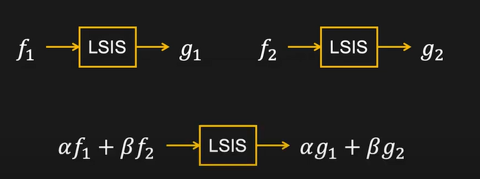
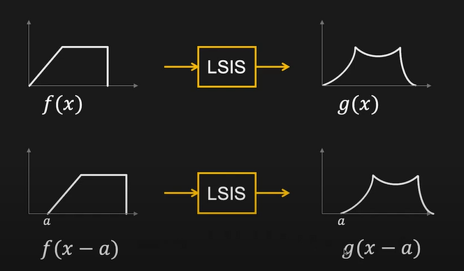
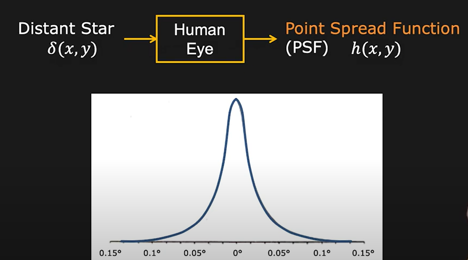
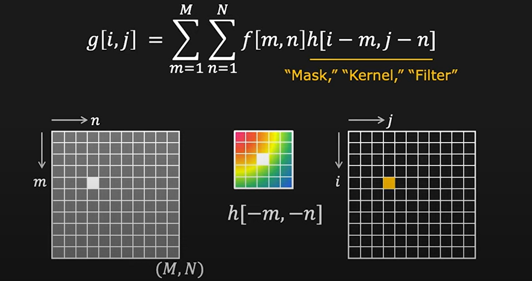
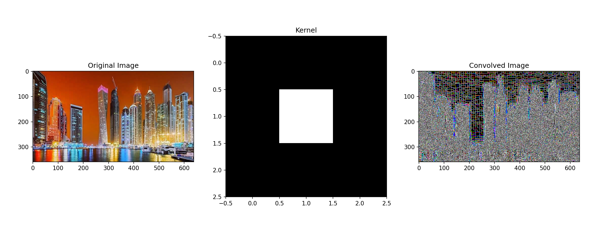
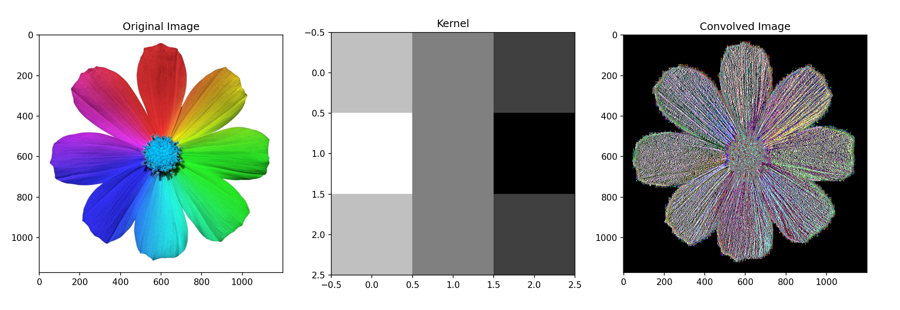
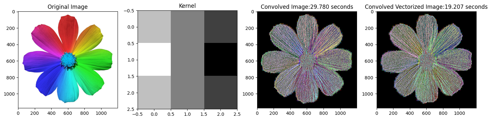
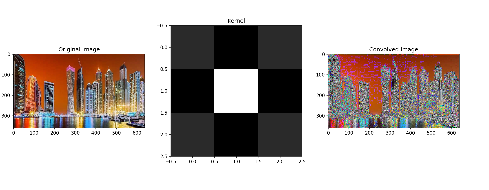
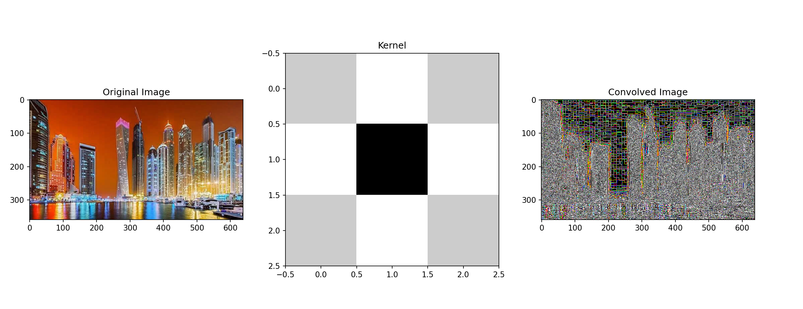

# Image Processing

#### 1. Pixel Processing (Point Processing)

- simplest

$g(x, y) = T(f(x, y))$

- For **brightness** change, add the value to the pixel value
- For **contrast** change, multiply the value to the pixel value

#### 2. LSIS and Convolution

- Linear Shift Invariant System
- Linearity:

  - 

- Shift Invariance:

  - 

- Ideal Lens is LSIS
  - Linearity: Brightness variation
  - Shift invariance: Scene Movement

##### - Convolution:

- slide a function from left to right of another function
- their product is the convolution, **convolved**!!
- Impulse Response of Human Eye:
  - Point Spread Function (PSF)
    

#### 3. Linear Image Filters

- Conolution with Discrete Images
- $h[i-m, j-n]$ is where the flipping happens
  - also called **kernel/mask/filter**

$$
\large
g[i, j] = \sum_{m=1}^{M} \sum_{n=1}^{N} f[m,n]h[i-m, j-n]
$$

##### Examples:

i. 

ii. With Sobel Filter:
`kernel = np.array([[1, 0, -1],
                  [2, 0, -2],
                  [1, 0, -1]])`

##### Simple and Vectorized Convolution Code (Sobel Filter)

- `np.sum()` used for faster computation

iii. With Unsharp Mask:
`kernel = np.array([[0, -1, 0],
                  [-1, 5, -1],
                  [0, -1, 0]])`

iv. Laplacian Filter:
`kernel = np.array([[0, 1, 0],
                  [1, -4, 1],
                  [0, 1, 0]])`

#### 4. Non-Linear Image Filters
