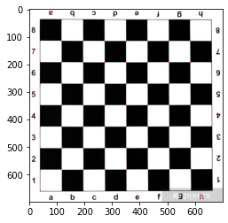
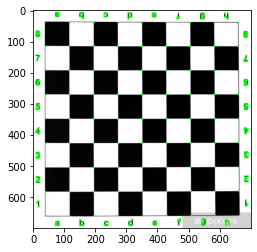

# Feature Detection

## Using opencv library for harris corner detection gives:

## Implementing harris corner detection 

1. Obtaining gradient matrices of the image using Sobel
2. Product of gradients
3. Smoothing them with gaussian filter (optional?)
4. Obtain determinant and trace of the matrices 
5. Get Harris Response as: $R = det - (k * (trace**2))$

The result is obtained as:
